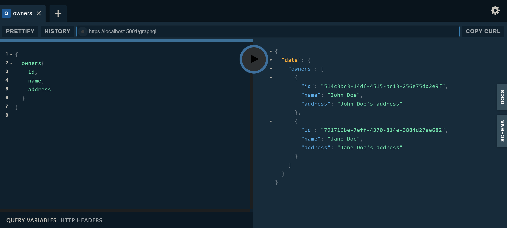

# GraphQL - .NET Core
## GraphQL ASP.NET Core Tutorial

[https://code-maze.com/graphql-asp-net-core-tutorial/](https://code-maze.com/graphql-asp-net-core-tutorial/)

[https://code-maze.com/graphql-aspnetcore-basics/](https://code-maze.com/graphql-aspnetcore-basics/)

[https://github.com/CodeMazeBlog/graphql-series/tree/getting-started-with-graphql](https://github.com/CodeMazeBlog/graphql-series/tree/getting-started-with-graphql)

[https://github.com/CodeMazeBlog/graphql-series/tree/consuming-graphql-with-aspnetcore](https://github.com/CodeMazeBlog/graphql-series/tree/consuming-graphql-with-aspnetcore)

## Startup

ConfigureServices (Startup.cs)
```csharp
services.AddScoped<IDependencyResolver>(s => new FuncDependencyResolver(s.GetRequiredService));
services.AddScoped<AppSchema>();

services.AddGraphQL(o => { o.ExposeExceptions = false; })
	.AddGraphTypes(ServiceLifetime.Scoped)
	.AddDataLoader();
```

Configure (Startup.cs)
```csharp
app.UseGraphQL<AppSchema>();
```

## Query in .NET
[https://code-maze.com/graphql-aspnetcore-basics/#integration](https://code-maze.com/graphql-aspnetcore-basics/#integration)

Define custom Types
```csharp
public class AccountType : ObjectGraphType<Account>
    {
        public AccountType()
        {
            Field(x => x.Id, type: typeof(IdGraphType)).Description("Id property from the account object.");
            Field(x => x.Description).Description("Description property from the account object.");
            Field(x => x.OwnerId, type: typeof(IdGraphType)).Description("OwnerId property from the account object.");
            Field<AccountTypeEnumType>("Type", "Enumeration for the account type object.");
            Field<DateTimeGraphType>("CreatedAt", resolve: context => DateTime.Now);
        }
    }
```

Define Schema
```csharp
public class AppSchema : Schema
    {
        public AppSchema(IDependencyResolver resolver)
            : base(resolver)
        {
            Query = resolver.Resolve<AppQuery>();
            Mutation = resolver.Resolve<AppMutation>();
        }
    }
```

Define Queries
```csharp
 public class AppQuery : ObjectGraphType
    {
        private const string OWNER_ID_ARGUMENT_NAME = "ownerId";

        public AppQuery(
            IOwnerRepository ownerRepository,
            IAccountRepository accountRepository)
        {
            Field<ListGraphType<OwnerType>>(
                "owners",
                resolve: context => ownerRepository.GetAll());

            Field<OwnerType>(
                "owner",
                arguments: new QueryArguments(new QueryArgument<NonNullGraphType<IdGraphType>> { Name = OWNER_ID_ARGUMENT_NAME }),
                resolve: context =>
                {
                    if (!Guid.TryParse(context.GetArgument<string>(OWNER_ID_ARGUMENT_NAME), out var id))
                    {
                        context.Errors.Add(new ExecutionError("Wrong value for Guid."));
                        return null;
                    }

                    return ownerRepository.GetById(id);
                }
            );

            Field<ListGraphType<AccountType>>(
                "accounts",
                resolve: context => accountRepository.GetAll());
        }
    }
```

## Pagination in .NET

TODO

## Mutation in .NET
[https://code-maze.com/graphql-mutations/](https://code-maze.com/graphql-mutations/)

Define Mutations
```csharp
public class AppMutation : ObjectGraphType
    {
        public AppMutation(IOwnerRepository ownerRepository)
        {
            Field<OwnerType>(
                "createOwner",
                arguments: new QueryArguments(new QueryArgument<NonNullGraphType<OwnerInputType>> { Name = "owner" }),
                resolve: context =>
                {
                    var owner = context.GetArgument<Owner>("owner");
                    return ownerRepository.CreateOwner(owner);
                }
            );

            Field<OwnerType>(
                "updateOwner",
                arguments: new QueryArguments(
                    new QueryArgument<NonNullGraphType<OwnerInputType>> { Name = "owner" },
                    new QueryArgument<NonNullGraphType<IdGraphType>> { Name = "ownerId" }),
                resolve: context =>
                {
                    var owner = context.GetArgument<Owner>("owner");
                    var ownerId = context.GetArgument<Guid>("ownerId");

                    var dbOwner = ownerRepository.GetById(ownerId);
                    if (dbOwner == null)
                    {
                        context.Errors.Add(new ExecutionError("Couldn't find owner in db."));
                        return null;
                    }

                    return ownerRepository.UpdateOwner(dbOwner, owner);
                }
            );

            Field<StringGraphType>(
                "deleteOwner",
                arguments: new QueryArguments(new QueryArgument<NonNullGraphType<IdGraphType>> { Name = "ownerId" }),
                resolve: context =>
                {
                    var ownerId = context.GetArgument<Guid>("ownerId");
                    var owner = ownerRepository.GetById(ownerId);
                    if (owner == null)
                    {
                        context.Errors.Add(new ExecutionError("Couldn't find owner in db."));
                        return null;
                    }

                    ownerRepository.DeleteOwner(owner);
                    return $"The owner with the id: {ownerId} has been successfully deleted from db.";
                }
            );
        }
    }
```

## Subscription in .NET

TODO

## Playground UI


